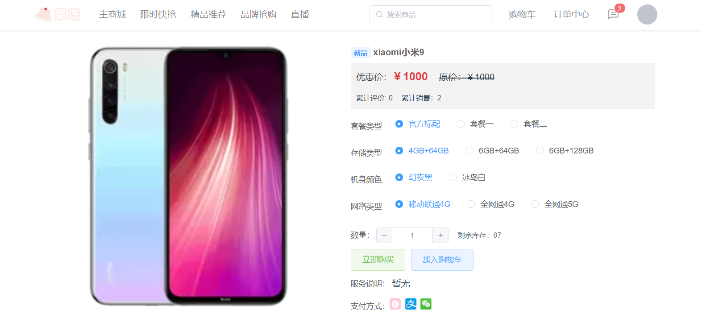
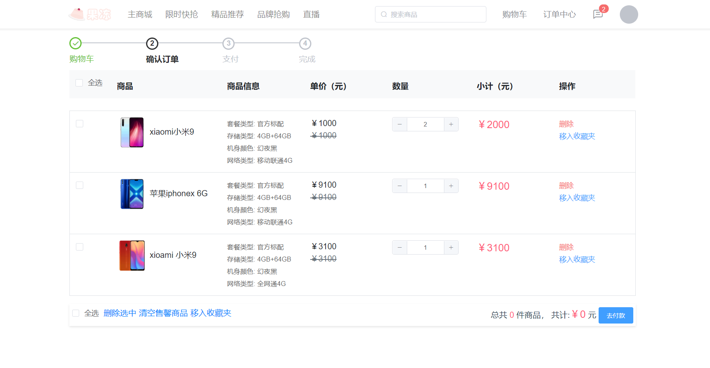
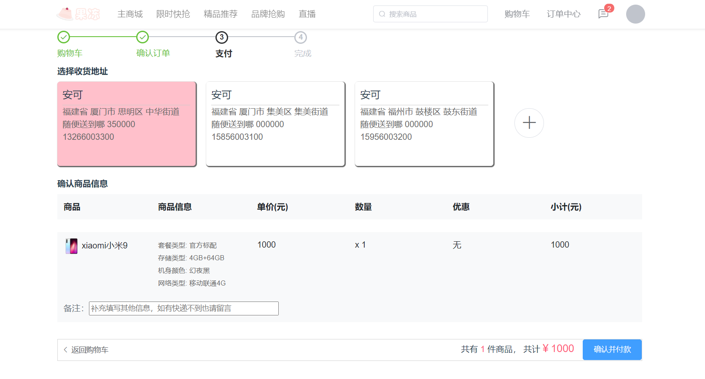
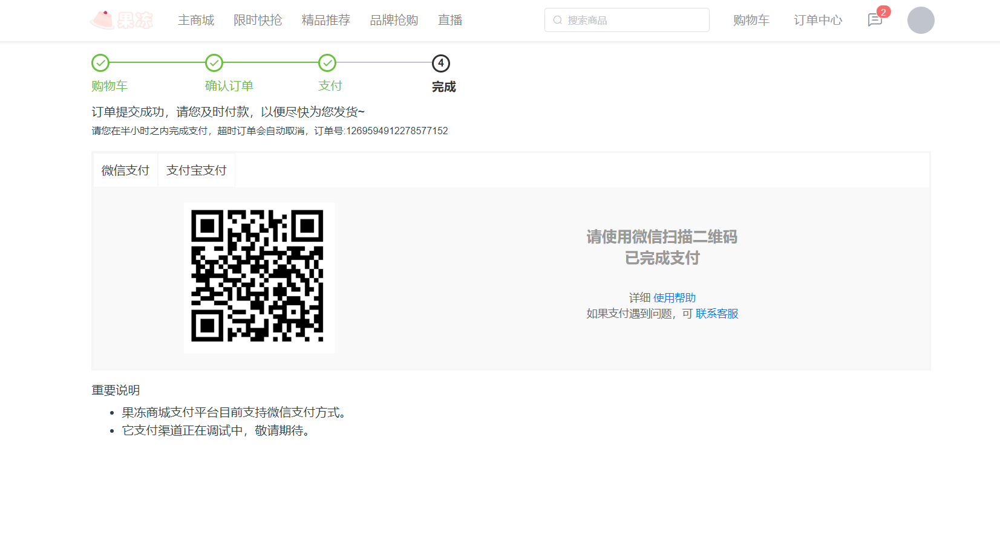

果冻商城-电商平台
====================


### 项目简介
```
目标：
    模拟商城，完整的购物流程、后端运营平台对前端业务的支撑，和对项目的运维，有各项的监控指标和运维指标。
技术点：
    核心框架：Spring Cloud、Dubbo、Spring Boot
    安全框架：Spring Security Oauth2
    网关框架：Spring Cloud Gateway
    持久层框架：MyBatis Plus、PageHelper
    数据库连接池：Alibaba Druid
    中间件：Redis、RocketMQ
    日志管理：Logback
    前端框架：Vue全家桶以及相关组件
```

### 目录结构说明
```
├─jelly-api------------------------------系统后台
|
├─jelly-app------------------------------系统前台
|
├─jelly-api------------------------------系统后端
│  │
│  ├─jelly-auth--------------------------微服务授权中心
│  │
│  ├─jelly-gateway-----------------------微服务网关中心
│  │  │
│  │  ├─jelly-gateway-web----------------web网关
│  │
│  ├─jelly-common------------------------微服务依赖中心
│  │  │
│  │  ├─jelly-common-base----------------基础依赖
│  │  │
│  │  ├─jelly-common-mpdb----------------持久层依赖
│  │  │
│  │  ├─jelly-common-util----------------工具包
│  │  │
│  │  ├─jelly-common-web-----------------web层依赖
│  │
│  ├─jelly-provider-----------------------微服务服务中心 - Spring Cloud版本
│  │  │
│  │  ├─jelly-provider-file---------------文件服务
│  │  │
│  │  ├─jelly-provider-goods--------------商品服务
│  │  │
│  │  ├─jelly-provider-order--------------订单服务
│  │  │
│  │  ├─jelly-provider-pay----------------支付服务
│  │  │
│  │  ├─jelly-provider-search-------------搜索服务
│  │  │
│  │  ├─jelly-provider-seckill------------秒杀服务
│  │  │
│  │  ├─jelly-provider-user---------------用户服务
│  │
│  ├─jelly-service-----------------------微服务服务中心 - Dubbo版本
│  │  │
│  │  ├─jelly-service-file---------------文件服务
│  │  │
│  │  ├─jelly-service-goods--------------商品服务
│  │  │
│  │  ├─jelly-service-order--------------订单服务
│  │  │
│  │  ├─jelly-service-pay----------------支付服务
│  │  │
│  │  ├─jelly-service-search-------------搜索服务
│  │  │
│  │  ├─jelly-service-seckill------------秒杀服务
│  │  │
│  │  ├─jelly-service-user---------------用户服务
│  │
│  ├─jelly-service-api-------------------微服务API依赖
```

### 实现的功能
```
后台：
    添加查看商品、添加查看秒杀商品
前台：
    登录注册、展示商品、添加购物车、完整下单流程、秒杀商品、添加收货地址、查看订单、微信支付
```

### 效果图
##### 首页


##### 商品列表


##### 商品详情


##### 购物车


##### 确认订单


##### 支付


##### 订单


